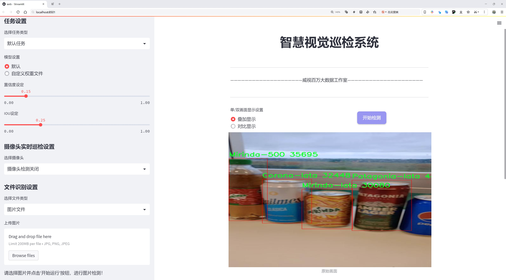
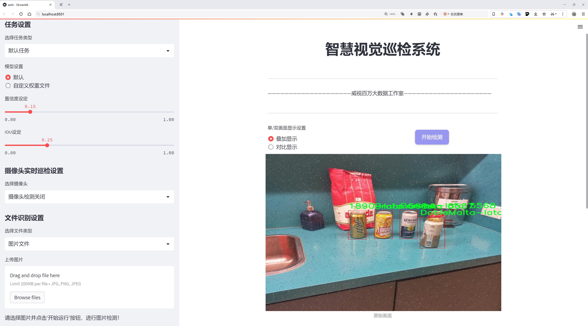
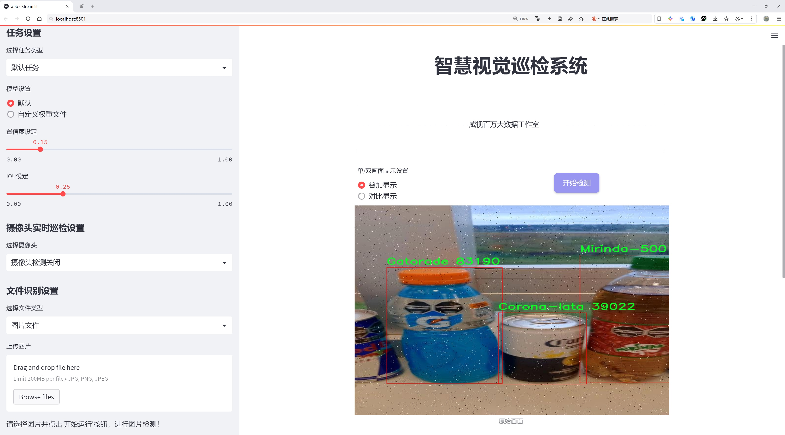
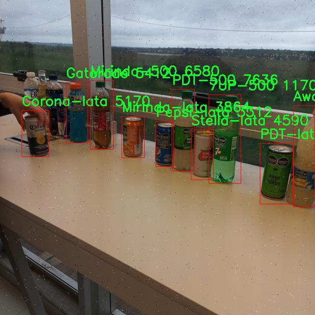
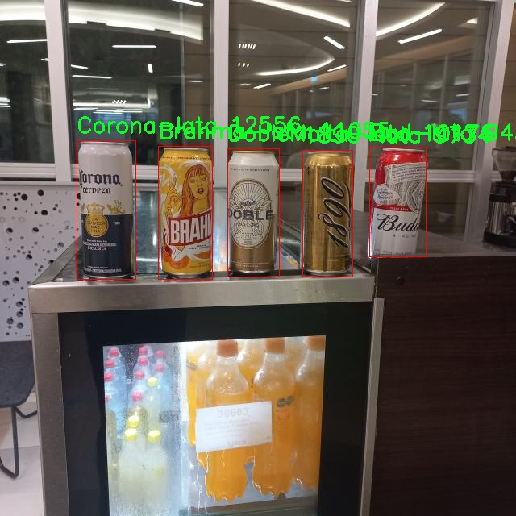
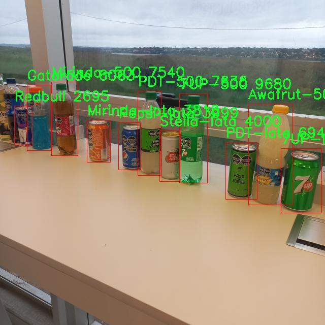
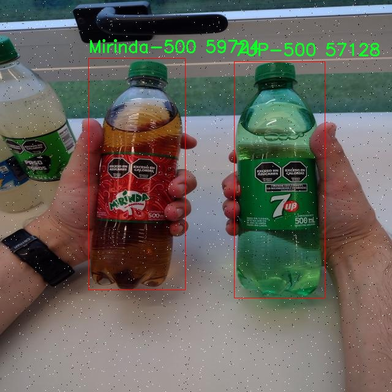
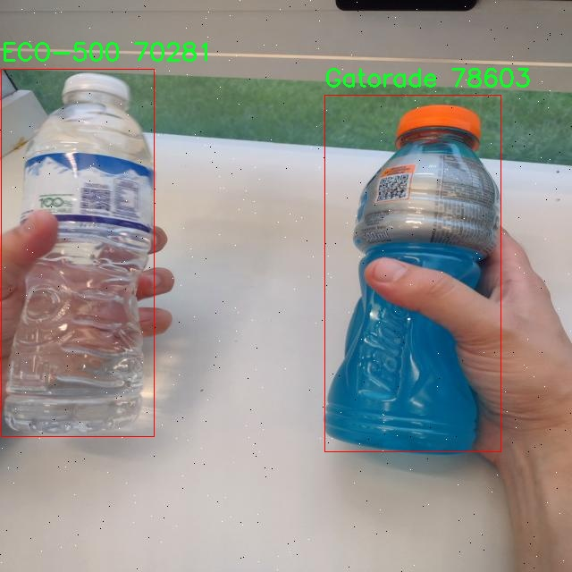
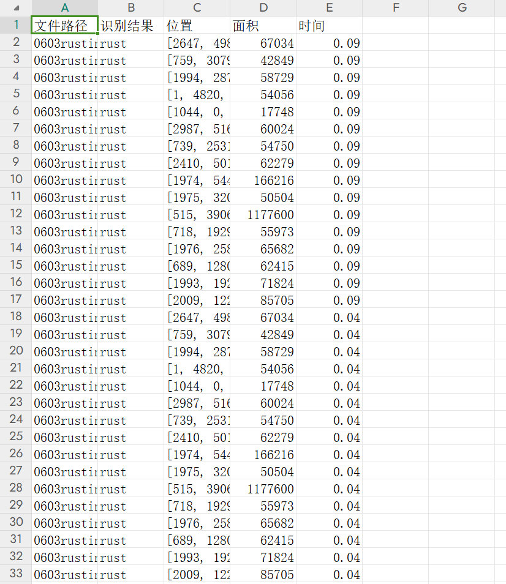

# 饮料瓶识别系统源码分享
 # [一条龙教学YOLOV8标注好的数据集一键训练_70+全套改进创新点发刊_Web前端展示]

### 1.研究背景与意义

项目参考[AAAI Association for the Advancement of Artificial Intelligence](https://gitee.com/qunmasj/projects)

项目来源[AACV Association for the Advancement of Computer Vision](https://kdocs.cn/l/cszuIiCKVNis)

研究背景与意义

随着全球饮料市场的快速发展，饮料瓶的种类和数量日益增加，如何高效、准确地识别和分类这些饮料瓶成为了计算机视觉领域中的一个重要研究课题。近年来，深度学习技术的迅猛发展为物体检测提供了新的解决方案，尤其是YOLO（You Only Look Once）系列模型因其高效性和实时性而备受关注。YOLOv8作为该系列的最新版本，结合了更为先进的网络结构和优化算法，能够在复杂环境中实现高精度的物体检测。因此，基于改进YOLOv8的饮料瓶识别系统的研究，不仅具有重要的学术价值，也对实际应用具有深远的意义。

在饮料瓶识别的研究中，数据集的构建是至关重要的一环。本研究所使用的"Bebidas_varias"数据集包含1400张图像，涵盖22个类别的饮料瓶，涉及1890-lata、7UP-500、Bud-lata等多种常见饮料品牌。这一数据集的多样性和丰富性为模型的训练提供了良好的基础，使得识别系统能够在不同品牌和包装形式的饮料瓶中进行有效的分类和识别。此外，数据集中包含的不同尺寸、形状和颜色的饮料瓶，能够帮助模型学习到更为复杂的特征，从而提升其在实际应用中的鲁棒性和准确性。

饮料瓶识别系统的研究不仅限于学术领域的探索，更在商业和社会层面上具有重要的应用价值。随着自动化和智能化技术的不断发展，饮料瓶的自动识别与分类在生产线、仓储管理、零售监控等场景中变得愈发重要。通过实现高效的饮料瓶识别，企业能够提高生产效率，降低人工成本，同时也能够提升消费者的购物体验。此外，准确的饮料瓶识别系统还有助于促进饮料行业的可持续发展，通过优化资源的利用和减少废弃物的产生，推动绿色经济的实现。

综上所述，基于改进YOLOv8的饮料瓶识别系统的研究，不仅能够推动计算机视觉技术的发展，还能为饮料行业的智能化转型提供有力支持。通过对"Bebidas_varias"数据集的深入分析与应用，本研究旨在提升饮料瓶识别的准确性和效率，为相关领域的研究者和从业者提供新的思路和方法。未来，随着技术的不断进步和数据集的不断丰富，饮料瓶识别系统的应用前景将更加广阔，必将为各行各业带来更多的创新与变革。

### 2.图片演示







##### 注意：由于此博客编辑较早，上面“2.图片演示”和“3.视频演示”展示的系统图片或者视频可能为老版本，新版本在老版本的基础上升级如下：（实际效果以升级的新版本为准）

  （1）适配了YOLOV8的“目标检测”模型和“实例分割”模型，通过加载相应的权重（.pt）文件即可自适应加载模型。

  （2）支持“图片识别”、“视频识别”、“摄像头实时识别”三种识别模式。

  （3）支持“图片识别”、“视频识别”、“摄像头实时识别”三种识别结果保存导出，解决手动导出（容易卡顿出现爆内存）存在的问题，识别完自动保存结果并导出到tempDir中。

  （4）支持Web前端系统中的标题、背景图等自定义修改，后面提供修改教程。

  另外本项目提供训练的数据集和训练教程,暂不提供权重文件（best.pt）,需要您按照教程进行训练后实现图片演示和Web前端界面演示的效果。

### 3.视频演示

[3.1 视频演示](https://www.bilibili.com/video/BV1XA11YqERd/)

### 4.数据集信息展示

##### 4.1 本项目数据集详细数据（类别数＆类别名）

nc: 22
names: ['1890-lata', '7UP-500', '7UP-lata', 'Andes-lata', 'Awafrut-500', 'Brahma-lata', 'Bud-lata', 'Corona-330', 'Corona-lata', 'DobleMalta-lata', 'ECO-500', 'Gatorade', 'Mirinda-500', 'Mirinda-lata', 'PDT-500', 'PDT-lata', 'Patagonia-lata', 'Pepsi-500', 'Pepsi-lata', 'Quilmes-lata', 'Redbull', 'Stella-lata']


##### 4.2 本项目数据集信息介绍

数据集信息展示

在本研究中，我们使用了名为“Bebidas_varias”的数据集，以改进YOLOv8的饮料瓶识别系统。该数据集专门针对饮料瓶的识别任务，包含了22个不同类别的饮料瓶样本。这些类别涵盖了多种流行的饮料品牌，具有广泛的代表性和多样性，为训练和测试模型提供了丰富的样本。

具体而言，数据集中包含的类别包括：1890-lata、7UP-500、7UP-lata、Andes-lata、Awafrut-500、Brahma-lata、Bud-lata、Corona-330、Corona-lata、DobleMalta-lata、ECO-500、Gatorade、Mirinda-500、Mirinda-lata、PDT-500、PDT-lata、Patagonia-lata、Pepsi-500、Pepsi-lata、Quilmes-lata、Redbull以及Stella-lata。这些类别不仅涵盖了不同品牌的饮料瓶，还包括了不同容量和包装形式的产品，如罐装和瓶装，确保了数据集的多样性和全面性。

数据集的设计旨在为饮料瓶的自动识别提供一个坚实的基础。每个类别的样本都经过精心挑选，确保在视觉特征上具有明显的差异性，以便于模型能够有效地学习和区分不同的饮料瓶。通过这种方式，模型在训练过程中能够捕捉到每种饮料瓶的独特特征，从而提高识别的准确性和鲁棒性。

此外，数据集中的样本数量和质量也经过严格控制，以确保模型在实际应用中的表现。每个类别都包含了多种不同角度、光照条件和背景下的样本，这样的多样性使得模型能够更好地适应现实环境中的各种变化。这对于提高模型在实际场景中的应用能力至关重要，因为饮料瓶的外观可能会因拍摄条件的不同而有所变化。

在训练过程中，我们将利用“Bebidas_varias”数据集中的样本进行数据增强，以进一步提高模型的泛化能力。通过旋转、缩放、裁剪和颜色变换等技术，我们可以生成更多的训练样本，从而使模型在面对未见过的样本时仍能保持较高的识别准确率。

总之，“Bebidas_varias”数据集为改进YOLOv8的饮料瓶识别系统提供了丰富的资源和坚实的基础。通过对该数据集的深入分析和有效利用，我们期望能够显著提升饮料瓶的自动识别能力，为相关领域的应用提供更为高效和准确的解决方案。随着研究的深入，我们相信该数据集将为饮料瓶识别技术的发展做出重要贡献，并推动智能识别系统在实际应用中的广泛推广。











### 5.全套项目环境部署视频教程（零基础手把手教学）

[5.1 环境部署教程链接（零基础手把手教学）](https://www.ixigua.com/7404473917358506534?logTag=c807d0cbc21c0ef59de5)


[5.2 安装Python虚拟环境创建和依赖库安装视频教程链接（零基础手把手教学）](https://www.ixigua.com/7404474678003106304?logTag=1f1041108cd1f708b01a)

### 6.手把手YOLOV8训练视频教程（零基础小白有手就能学会）

[6.1 手把手YOLOV8训练视频教程（零基础小白有手就能学会）](https://www.ixigua.com/7404477157818401292?logTag=d31a2dfd1983c9668658)


按照上面的训练视频教程链接加载项目提供的数据集，运行train.py即可开始训练



     Epoch   gpu_mem       box       obj       cls    labels  img_size
     1/200     20.8G   0.01576   0.01955  0.007536        22      1280: 100%|██████████| 849/849 [14:42<00:00,  1.04s/it]
               Class     Images     Labels          P          R     mAP@.5 mAP@.5:.95: 100%|██████████| 213/213 [01:14<00:00,  2.87it/s]
                 all       3395      17314      0.994      0.957      0.0957      0.0843

     Epoch   gpu_mem       box       obj       cls    labels  img_size
     2/200     20.8G   0.01578   0.01923  0.007006        22      1280: 100%|██████████| 849/849 [14:44<00:00,  1.04s/it]
               Class     Images     Labels          P          R     mAP@.5 mAP@.5:.95: 100%|██████████| 213/213 [01:12<00:00,  2.95it/s]
                 all       3395      17314      0.996      0.956      0.0957      0.0845

     Epoch   gpu_mem       box       obj       cls    labels  img_size
     3/200     20.8G   0.01561    0.0191  0.006895        27      1280: 100%|██████████| 849/849 [10:56<00:00,  1.29it/s]
               Class     Images     Labels          P          R     mAP@.5 mAP@.5:.95: 100%|███████   | 187/213 [00:52<00:00,  4.04it/s]
                 all       3395      17314      0.996      0.957      0.0957      0.0845


### 7.70+种全套YOLOV8创新点代码加载调参视频教程（一键加载写好的改进模型的配置文件）

[7.1 70+种全套YOLOV8创新点代码加载调参视频教程（一键加载写好的改进模型的配置文件）](https://www.ixigua.com/7404478314661806627?logTag=29066f8288e3f4eea3a4)

### 8.70+种全套YOLOV8创新点原理讲解（非科班也可以轻松写刊发刊，V10版本正在科研待更新）

#### 由于篇幅限制，每个创新点的具体原理讲解就不一一展开，具体见下列网址中的创新点对应子项目的技术原理博客网址【Blog】：


[8.1 70+种全套YOLOV8创新点原理讲解链接](https://gitee.com/qunmasj/good)

#### 部分改进原理讲解(完整的改进原理见上图和技术博客链接)

### YOLOv8简介

按照官方描述，YOLOv8 是一个 SOTA 模型，它建立在以前 YOLO 版本的成功基础上，并引入了新的功能和改进，以进一步提升性能和灵活性。具体创新包括一个新的骨干网络、一个新的 Ancher-Free 检测头和一个新的损失函数，可以在从 CPU 到 GPU 的各种硬件平台上运行。

不过 ultralytics 并没有直接将开源库命名为 YOLOv8，而是直接使用 ultralytics 这个词，原因是 ultralytics 将这个库定位为算法框架，而非某一个特定算法，一个主要特点是可扩展性。其希望这个库不仅仅能够用于 YOLO 系列模型，而是能够支持非 YOLO 模型以及分类分割姿态估计等各类任务。
总而言之，ultralytics 开源库的两个主要优点是：

融合众多当前 SOTA 技术于一体
未来将支持其他 YOLO 系列以及 YOLO 之外的更多算法


下表为官方在 COCO Val 2017 数据集上测试的 mAP、参数量和 FLOPs 结果。可以看出 YOLOv8 相比 YOLOv5 精度提升非常多，但是 N/S/M 模型相应的参数量和 FLOPs 都增加了不少，从上图也可以看出相比 YOLOV5 大部分模型推理速度变慢了。


额外提一句，现在各个 YOLO 系列改进算法都在 COCO 上面有明显性能提升，但是在自定义数据集上面的泛化性还没有得到广泛验证，至今依然听到不少关于 YOLOv5 泛化性能较优异的说法。对各系列 YOLO 泛化性验证也是 MMYOLO 中一个特别关心和重点发力的方向。

### YOLO-MS简介
实时目标检测，以YOLO系列为例，已在工业领域中找到重要应用，特别是在边缘设备（如无人机和机器人）中。与之前的目标检测器不同，实时目标检测器旨在在速度和准确性之间追求最佳平衡。为了实现这一目标，提出了大量的工作：从第一代DarkNet到CSPNet，再到最近的扩展ELAN，随着性能的快速增长，实时目标检测器的架构经历了巨大的变化。

尽管性能令人印象深刻，但在不同尺度上识别对象仍然是实时目标检测器面临的基本挑战。这促使作者设计了一个强大的编码器架构，用于学习具有表现力的多尺度特征表示。具体而言，作者从两个新的角度考虑为实时目标检测编码多尺度特征：

从局部视角出发，作者设计了一个具有简单而有效的分层特征融合策略的MS-Block。受到Res2Net的启发，作者在MS-Block中引入了多个分支来进行特征提取，但不同的是，作者使用了一个带有深度卷积的 Inverted Bottleneck Block块，以实现对大Kernel的高效利用。

从全局视角出发，作者提出随着网络加深逐渐增加卷积的Kernel-Size。作者在浅层使用小Kernel卷积来更高效地处理高分辨率特征。另一方面，在深层中，作者采用大Kernel卷积来捕捉广泛的信息。

基于以上设计原则，作者呈现了作者的实时目标检测器，称为YOLO-MS。为了评估作者的YOLO-MS的性能，作者在MS COCO数据集上进行了全面的实验。还提供了与其他最先进方法的定量比较，以展示作者方法的强大性能。如图1所示，YOLO-MS在计算性能平衡方面优于其他近期的实时目标检测器。


具体而言，YOLO-MS-XS在MS COCO上获得了43%+的AP得分，仅具有450万个可学习参数和8.7亿个FLOPs。YOLO-MS-S和YOLO-MS分别获得了46%+和51%+的AP，可学习参数分别为810万和2220万。此外，作者的工作还可以作为其他YOLO模型的即插即用模块。通常情况下，作者的方法可以将YOLOv8的AP从37%+显著提高到40%+，甚至还可以使用更少的参数和FLOPs。


#### Multi-Scale Building Block Design
CSP Block是一个基于阶段级梯度路径的网络，平衡了梯度组合和计算成本。它是广泛应用于YOLO系列的基本构建块。已经提出了几种变体，包括YOLOv4和YOLOv5中的原始版本，Scaled YOLOv4中的CSPVoVNet，YOLOv7中的ELAN，以及RTMDet中提出的大Kernel单元。作者在图2(a)和图2(b)中分别展示了原始CSP块和ELAN的结构。


上述实时检测器中被忽视的一个关键方面是如何在基本构建块中编码多尺度特征。其中一个强大的设计原则是Res2Net，它聚合了来自不同层次的特征以增强多尺度表示。然而，这一原则并没有充分探索大Kernel卷积的作用，而大Kernel卷积已经在基于CNN的视觉识别任务模型中证明有效。将大Kernel卷积纳入Res2Net的主要障碍在于它们引入的计算开销，因为构建块采用了标准卷积。在作者的方法中，作者提出用 Inverted Bottleneck Block替代标准的3 × 3卷积，以享受大Kernel卷积的好处。

基于前面的分析，作者提出了一个带有分层特征融合策略的全新Block，称为MS-Block，以增强实时目标检测器在提取多尺度特征时的能力，同时保持快速的推理速度。

MS-Block的具体结构如图2(c)所示。假设是输入特征。通过1×1卷积的转换后，X的通道维度增加到n*C。然后，作者将X分割成n个不同的组，表示为，其中。为了降低计算成本，作者选择n为3。

注意，除了之外，每个其他组都经过一个 Inverted Bottleneck Block层，用表示，其中k表示Kernel-Size，以获得。的数学表示如下：


根据这个公式，该博客的作者不将 Inverted Bottleneck Block层连接，使其作为跨阶段连接，并保留来自前面层的信息。最后，作者将所有分割连接在一起，并应用1×1卷积来在所有分割之间进行交互，每个分割都编码不同尺度的特征。当网络加深时，这个1×1卷积也用于调整通道数。

#### Heterogeneous Kernel Selection Protocol
除了构建块的设计外，作者还从宏观角度探讨了卷积的使用。之前的实时目标检测器在不同的编码器阶段采用了同质卷积（即具有相同Kernel-Size的卷积），但作者认为这不是提取多尺度语义信息的最佳选项。

在金字塔结构中，从检测器的浅阶段提取的高分辨率特征通常用于捕捉细粒度语义，将用于检测小目标。相反，来自网络较深阶段的低分辨率特征用于捕捉高级语义，将用于检测大目标。如果作者在所有阶段都采用统一的小Kernel卷积，深阶段的有效感受野（ERF）将受到限制，影响大目标的性能。在每个阶段中引入大Kernel卷积可以帮助解决这个问题。然而，具有大的ERF的大Kernel可以编码更广泛的区域，这增加了在小目标外部包含噪声信息的概率，并且降低了推理速度。

在这项工作中，作者建议在不同阶段中采用异构卷积，以帮助捕获更丰富的多尺度特征。具体来说，在编码器的第一个阶段中，作者采用最小Kernel卷积，而最大Kernel卷积位于最后一个阶段。随后，作者逐步增加中间阶段的Kernel-Size，使其与特征分辨率的增加保持一致。这种策略允许提取细粒度和粗粒度的语义信息，增强了编码器的多尺度特征表示能力。

正如图所示，作者将k的值分别分配给编码器中的浅阶段到深阶段，取值为3、5、7和9。作者将其称为异构Kernel选择（HKS）协议。


作者的HKS协议能够在深层中扩大感受野，而不会对浅层产生任何其他影响。此外，HKS不仅有助于编码更丰富的多尺度特征，还确保了高效的推理。

如表1所示，将大Kernel卷积应用于高分辨率特征会产生较高的计算开销。然而，作者的HKS协议在低分辨率特征上采用大Kernel卷积，从而与仅使用大Kernel卷积相比，大大降低了计算成本。


在实践中，作者经验性地发现，采用HKS协议的YOLO-MS的推理速度几乎与仅使用深度可分离的3 × 3卷积相同。

#### Architecture
如图所示，作者模型的Backbone由4个阶段组成，每个阶段后面跟随1个步长为2的3 × 3卷积进行下采样。在第3个阶段后，作者添加了1个SPP块，与RTMDet中一样。在作者的编码器上，作者使用PAFPN作为Neck来构建特征金字塔[31, 35]。它融合了从Backbone不同阶段提取的多尺度特征。Neck中使用的基本构建块也是作者的MS-Block，在其中使用3 × 3深度可分离卷积进行快速推理。

此外，为了在速度和准确性之间取得更好的平衡，作者将Backbone中多级特征的通道深度减半。作者提供了3个不同尺度的YOLO-MS变体，即YOLO-MS-XS、YOLO-MS-S和YOLO-MS。不同尺度的YOLO-MS的详细配置列在表2中。对于YOLO-MS的其他部分，作者将其保持与RTMDet相同。


### 9.系统功能展示（检测对象为举例，实际内容以本项目数据集为准）

图9.1.系统支持检测结果表格显示

  图9.2.系统支持置信度和IOU阈值手动调节

  图9.3.系统支持自定义加载权重文件best.pt(需要你通过步骤5中训练获得)

  图9.4.系统支持摄像头实时识别

  图9.5.系统支持图片识别

  图9.6.系统支持视频识别

  图9.7.系统支持识别结果文件自动保存

  图9.8.系统支持Excel导出检测结果数据




### 10.原始YOLOV8算法原理

原始YOLOv8算法原理

YOLOv8作为目标检测领域的一项重要进展，建立在YOLO系列算法的基础上，特别是YOLOv5的架构之上，进行了多方面的优化和升级。该算法的设计目标是提高检测精度、推理速度以及模型的轻量化，使其在各种应用场景中表现出色。YOLOv8提供了五种不同规模的模型，包括n、s、m、l和x，以满足不同需求的应用场景。每种模型的设计不仅考虑了深度和宽度的变化，还在主干网络的通道数上进行了调整，以确保在不同规模下都能实现最佳性能。

YOLOv8的网络结构主要由三个部分组成：输入端、主干网络和检测端。输入端负责接收图像数据，主干网络则负责特征提取，而检测端则负责将提取到的特征进行处理，最终输出检测结果。YOLOv8n模型作为原始算法，其网络结构采用了轻量化的C2F模块替代了YOLOv5中的C3模块。C2F模块的设计灵感来源于YOLOv7中的ELAN模块，结合了更多的残差连接，使得模型在保持轻量化的同时，能够获取更加丰富的梯度信息，从而提升特征提取的能力。

在特征融合层，YOLOv8n采用了特征金字塔网络（FPN）与路径聚合网络（PAN）的结合，形成了一个高效的特征融合结构。为了进一步提升模型的轻量化，YOLOv8n引入了BiFPN网络。BiFPN的设计理念是实现高效的双向跨尺度连接和加权特征融合，通过删除单输入对应的节点，并在同一层的输入输出节点之间添加连接，从而优化特征的传递和融合。这种结构使得YOLOv8n能够快速提取不同尺度的特征信息，增强了模型在多尺度目标检测中的表现。

在检测头部分，YOLOv8n采用了轻量化的解耦头结构，将分类和检测任务分离开来，取代了传统的耦合头结构。这种解耦合的设计使得模型在处理目标检测时能够更加高效，同时将Anchor-Based的检测方式转变为Anchor-Free的方法，简化了目标检测的过程，提高了检测的灵活性和准确性。

YOLOv8在训练过程中也引入了一些创新的策略。在数据增强方面，模型在训练的最后10个epoch中关闭了马赛克增强，并采用了动态的Task-Aligned Assigner样本分配策略。这种策略能够根据任务的需求动态调整样本的分配，提高了训练的效率和效果。此外，在损失计算方面，YOLOv8采用了BCELoss作为分类损失，同时结合DFLLoss和CIoULoss作为回归损失，这种多重损失函数的设计进一步提升了模型的学习能力和准确性。

YOLOv8的成功不仅体现在其创新的网络结构和训练策略上，还在于其优越的性能表现。与之前的YOLO版本相比，YOLOv8在推理速度和检测精度上都有显著提升，能够更好地适应实时目标检测的需求。其广泛的硬件支持和原生自定义数据集的能力，使得YOLOv8成为了业界最流行和成功的目标检测模型之一。

总的来说，YOLOv8通过对网络结构的优化、特征提取和融合的改进、检测头的解耦合设计以及创新的训练策略，形成了一种高效、轻量化且性能卓越的目标检测算法。这些创新不仅提升了模型的检测能力，也为未来的目标检测研究提供了新的思路和方向。随着YOLOv8的广泛应用，预计将在自动驾驶、视频监控、智能安防等多个领域发挥重要作用，推动目标检测技术的进一步发展。


### 11.项目核心源码讲解（再也不用担心看不懂代码逻辑）

#### 11.1 code\ultralytics\hub\__init__.py

以下是对代码的核心部分进行提炼和详细注释的结果：

```python
# 导入所需的库和模块
import requests
from ultralytics.data.utils import HUBDatasetStats
from ultralytics.hub.auth import Auth
from ultralytics.hub.utils import HUB_API_ROOT, HUB_WEB_ROOT, PREFIX
from ultralytics.utils import LOGGER, SETTINGS, checks

def login(api_key: str = None, save=True) -> bool:
    """
    使用提供的API密钥登录Ultralytics HUB API。

    如果未提供API密钥，将从SETTINGS或HUB_API_KEY环境变量中检索。

    参数:
        api_key (str, optional): 用于身份验证的API密钥。如果未提供，将从SETTINGS或HUB_API_KEY环境变量中检索。
        save (bool, optional): 如果身份验证成功，是否将API密钥保存到SETTINGS中。
    
    返回:
        bool: 如果身份验证成功则返回True，否则返回False。
    """
    checks.check_requirements("hub-sdk>=0.0.2")  # 检查所需的库版本
    from hub_sdk import HUBClient  # 导入HUBClient类

    # 设置API密钥的URL
    api_key_url = f"{HUB_WEB_ROOT}/settings?tab=api+keys"
    saved_key = SETTINGS.get("api_key")  # 从SETTINGS中获取已保存的API密钥
    active_key = api_key or saved_key  # 优先使用提供的API密钥，其次使用已保存的密钥
    credentials = {"api_key": active_key} if active_key else None  # 设置凭据

    client = HUBClient(credentials)  # 初始化HUBClient

    if client.authenticated:  # 如果身份验证成功
        if save and client.api_key != saved_key:
            SETTINGS.update({"api_key": client.api_key})  # 更新SETTINGS中的API密钥

        # 根据提供的密钥或从设置中检索的密钥设置日志消息
        log_message = (
            "New authentication successful ✅" if client.api_key == api_key or not credentials else "Authenticated ✅"
        )
        LOGGER.info(f"{PREFIX}{log_message}")  # 记录成功的身份验证信息

        return True
    else:
        # 身份验证失败
        LOGGER.info(f"{PREFIX}Retrieve API key from {api_key_url}")
        return False

def logout():
    """
    从Ultralytics HUB注销，移除设置文件中的API密钥。
    重新登录请使用'yolo hub login'。
    """
    SETTINGS["api_key"] = ""  # 清空API密钥
    SETTINGS.save()  # 保存设置
    LOGGER.info(f"{PREFIX}logged out ✅. To log in again, use 'yolo hub login'.")

def check_dataset(path="", task="detect"):
    """
    在上传之前检查HUB数据集Zip文件的错误。
    
    参数:
        path (str, optional): 数据集Zip文件的路径（其中包含data.yaml）。默认为''。
        task (str, optional): 数据集任务。选项包括'detect'、'segment'、'pose'、'classify'。默认为'detect'。
    
    示例:
        check_dataset('path/to/coco8.zip', task='detect')  # 检测数据集
    """
    HUBDatasetStats(path=path, task=task).get_json()  # 获取数据集统计信息
    LOGGER.info(f"Checks completed correctly ✅. Upload this dataset to {HUB_WEB_ROOT}/datasets/.")  # 记录检查完成的信息
```

### 核心部分说明：
1. **登录功能 (`login`)**: 该函数用于通过API密钥进行身份验证，支持从设置中检索密钥，并在成功后选择性地保存密钥。
2. **注销功能 (`logout`)**: 该函数用于注销用户，清空存储的API密钥。
3. **数据集检查功能 (`check_dataset`)**: 该函数用于在上传数据集之前检查其有效性，确保数据集格式正确。 

以上是代码的核心部分及其详细注释，帮助理解其功能和用途。

这个文件是Ultralytics YOLO项目的一部分，主要用于与Ultralytics HUB进行交互，提供了一些功能来登录、登出、导出模型、检查数据集等。

首先，文件导入了一些必要的模块和工具，包括用于处理数据集统计的`HUBDatasetStats`、用于身份验证的`Auth`、一些常量如`HUB_API_ROOT`和`HUB_WEB_ROOT`，以及日志记录和设置管理的工具。

在`login`函数中，用户可以通过提供API密钥来登录Ultralytics HUB。如果没有提供密钥，函数会尝试从设置或环境变量中获取。成功认证后，可以选择将API密钥保存到设置中，以便下次使用。函数返回一个布尔值，指示认证是否成功。

`logout`函数则用于登出，简单地将设置中的API密钥清空，并记录登出信息。用户可以通过调用`yolo hub login`重新登录。

`reset_model`函数允许用户将训练好的模型重置为未训练状态。它通过向HUB API发送POST请求来实现，成功后会记录相关信息。

`export_fmts_hub`函数返回HUB支持的导出格式列表，包括一些特定的格式如`ultralytics_tflite`和`ultralytics_coreml`。

`export_model`函数用于将模型导出为指定格式。它首先检查所请求的格式是否受支持，然后向HUB API发送请求以开始导出过程。

`get_export`函数则用于获取已导出的模型的字典，包括下载链接。它同样会检查格式的有效性，并向HUB API发送请求。

最后，`check_dataset`函数用于在上传数据集之前检查ZIP文件的错误。它确保数据集符合要求，并记录检查完成的信息，提示用户可以将数据集上传到HUB。

总体来说，这个文件提供了一系列与Ultralytics HUB交互的功能，方便用户进行模型管理和数据集处理。

#### 11.2 code\ultralytics\utils\tal.py

以下是代码中最核心的部分，并附上详细的中文注释：

```python
import torch
import torch.nn as nn

class TaskAlignedAssigner(nn.Module):
    """
    任务对齐分配器，用于目标检测。

    该类根据任务对齐指标将真实目标（gt）分配给锚点，该指标结合了分类和定位信息。

    属性：
        topk (int): 考虑的前候选数量。
        num_classes (int): 目标类别数量。
        alpha (float): 任务对齐指标分类部分的alpha参数。
        beta (float): 任务对齐指标定位部分的beta参数。
        eps (float): 防止除以零的小值。
    """

    def __init__(self, topk=13, num_classes=80, alpha=1.0, beta=6.0, eps=1e-9):
        """初始化任务对齐分配器对象，允许自定义超参数。"""
        super().__init__()
        self.topk = topk  # 考虑的前k个候选
        self.num_classes = num_classes  # 类别数量
        self.bg_idx = num_classes  # 背景类别索引
        self.alpha = alpha  # 分类部分的权重
        self.beta = beta  # 定位部分的权重
        self.eps = eps  # 防止除零的小值

    @torch.no_grad()
    def forward(self, pd_scores, pd_bboxes, anc_points, gt_labels, gt_bboxes, mask_gt):
        """
        计算任务对齐分配。

        参数：
            pd_scores (Tensor): 预测分数，形状为(bs, num_total_anchors, num_classes)
            pd_bboxes (Tensor): 预测边界框，形状为(bs, num_total_anchors, 4)
            anc_points (Tensor): 锚点坐标，形状为(num_total_anchors, 2)
            gt_labels (Tensor): 真实标签，形状为(bs, n_max_boxes, 1)
            gt_bboxes (Tensor): 真实边界框，形状为(bs, n_max_boxes, 4)
            mask_gt (Tensor): 真实目标掩码，形状为(bs, n_max_boxes, 1)

        返回：
            target_labels (Tensor): 目标标签，形状为(bs, num_total_anchors)
            target_bboxes (Tensor): 目标边界框，形状为(bs, num_total_anchors, 4)
            target_scores (Tensor): 目标分数，形状为(bs, num_total_anchors, num_classes)
            fg_mask (Tensor): 前景掩码，形状为(bs, num_total_anchors)
            target_gt_idx (Tensor): 目标真实索引，形状为(bs, num_total_anchors)
        """
        self.bs = pd_scores.size(0)  # 批次大小
        self.n_max_boxes = gt_bboxes.size(1)  # 最大目标数量

        # 如果没有真实目标，返回背景标签和零值
        if self.n_max_boxes == 0:
            device = gt_bboxes.device
            return (
                torch.full_like(pd_scores[..., 0], self.bg_idx).to(device),
                torch.zeros_like(pd_bboxes).to(device),
                torch.zeros_like(pd_scores).to(device),
                torch.zeros_like(pd_scores[..., 0]).to(device),
                torch.zeros_like(pd_scores[..., 0]).to(device),
            )

        # 获取正样本掩码、对齐指标和重叠度
        mask_pos, align_metric, overlaps = self.get_pos_mask(
            pd_scores, pd_bboxes, gt_labels, gt_bboxes, anc_points, mask_gt
        )

        # 选择重叠度最高的目标
        target_gt_idx, fg_mask, mask_pos = self.select_highest_overlaps(mask_pos, overlaps, self.n_max_boxes)

        # 获取分配的目标
        target_labels, target_bboxes, target_scores = self.get_targets(gt_labels, gt_bboxes, target_gt_idx, fg_mask)

        # 归一化对齐指标
        align_metric *= mask_pos
        pos_align_metrics = align_metric.amax(dim=-1, keepdim=True)  # b, max_num_obj
        pos_overlaps = (overlaps * mask_pos).amax(dim=-1, keepdim=True)  # b, max_num_obj
        norm_align_metric = (align_metric * pos_overlaps / (pos_align_metrics + self.eps)).amax(-2).unsqueeze(-1)
        target_scores = target_scores * norm_align_metric  # 更新目标分数

        return target_labels, target_bboxes, target_scores, fg_mask.bool(), target_gt_idx

    def get_pos_mask(self, pd_scores, pd_bboxes, gt_labels, gt_bboxes, anc_points, mask_gt):
        """获取正样本掩码，形状为(b, max_num_obj, h*w)。"""
        mask_in_gts = self.select_candidates_in_gts(anc_points, gt_bboxes)  # 选择在真实目标内的锚点
        align_metric, overlaps = self.get_box_metrics(pd_scores, pd_bboxes, gt_labels, gt_bboxes, mask_in_gts * mask_gt)  # 计算对齐指标和重叠度
        mask_topk = self.select_topk_candidates(align_metric, topk_mask=mask_gt.expand(-1, -1, self.topk).bool())  # 选择前k个候选
        mask_pos = mask_topk * mask_in_gts * mask_gt  # 合并所有掩码

        return mask_pos, align_metric, overlaps

    def get_box_metrics(self, pd_scores, pd_bboxes, gt_labels, gt_bboxes, mask_gt):
        """计算给定预测和真实边界框的对齐指标。"""
        na = pd_bboxes.shape[-2]  # 锚点数量
        mask_gt = mask_gt.bool()  # 转换为布尔类型掩码
        overlaps = torch.zeros([self.bs, self.n_max_boxes, na], dtype=pd_bboxes.dtype, device=pd_bboxes.device)  # 初始化重叠度
        bbox_scores = torch.zeros([self.bs, self.n_max_boxes, na], dtype=pd_scores.dtype, device=pd_scores.device)  # 初始化边界框分数

        ind = torch.zeros([2, self.bs, self.n_max_boxes], dtype=torch.long)  # 创建索引
        ind[0] = torch.arange(end=self.bs).view(-1, 1).expand(-1, self.n_max_boxes)  # 批次索引
        ind[1] = gt_labels.squeeze(-1)  # 真实标签索引
        bbox_scores[mask_gt] = pd_scores[ind[0], :, ind[1]][mask_gt]  # 获取每个网格的分数

        # 计算重叠度
        pd_boxes = pd_bboxes.unsqueeze(1).expand(-1, self.n_max_boxes, -1, -1)[mask_gt]
        gt_boxes = gt_bboxes.unsqueeze(2).expand(-1, -1, na, -1)[mask_gt]
        overlaps[mask_gt] = self.iou_calculation(gt_boxes, pd_boxes)  # 计算IoU

        align_metric = bbox_scores.pow(self.alpha) * overlaps.pow(self.beta)  # 计算对齐指标
        return align_metric, overlaps

    def iou_calculation(self, gt_bboxes, pd_bboxes):
        """计算水平边界框的IoU。"""
        return bbox_iou(gt_bboxes, pd_bboxes, xywh=False, CIoU=True).squeeze(-1).clamp_(0)  # 计算IoU并限制在0以上

    def select_topk_candidates(self, metrics, largest=True, topk_mask=None):
        """根据给定指标选择前k个候选。"""
        topk_metrics, topk_idxs = torch.topk(metrics, self.topk, dim=-1, largest=largest)  # 获取前k个指标和索引
        if topk_mask is None:
            topk_mask = (topk_metrics.max(-1, keepdim=True)[0] > self.eps).expand_as(topk_idxs)  # 生成掩码
        topk_idxs.masked_fill_(~topk_mask, 0)  # 用0填充无效索引

        count_tensor = torch.zeros(metrics.shape, dtype=torch.int8, device=topk_idxs.device)  # 初始化计数张量
        ones = torch.ones_like(topk_idxs[:, :, :1], dtype=torch.int8, device=topk_idxs.device)  # 创建全1张量
        for k in range(self.topk):
            count_tensor.scatter_add_(-1, topk_idxs[:, :, k : k + 1], ones)  # 统计每个锚点的计数
        count_tensor.masked_fill_(count_tensor > 1, 0)  # 过滤无效边界框

        return count_tensor.to(metrics.dtype)  # 返回有效的计数张量

    def get_targets(self, gt_labels, gt_bboxes, target_gt_idx, fg_mask):
        """计算正样本锚点的目标标签、目标边界框和目标分数。"""
        batch_ind = torch.arange(end=self.bs, dtype=torch.int64, device=gt_labels.device)[..., None]  # 批次索引
        target_gt_idx = target_gt_idx + batch_ind * self.n_max_boxes  # 计算目标真实索引
        target_labels = gt_labels.long().flatten()[target_gt_idx]  # 获取目标标签

        target_bboxes = gt_bboxes.view(-1, gt_bboxes.shape[-1])[target_gt_idx]  # 获取目标边界框

        target_labels.clamp_(0)  # 限制标签在有效范围内

        target_scores = torch.zeros(
            (target_labels.shape[0], target_labels.shape[1], self.num_classes),
            dtype=torch.int64,
            device=target_labels.device,
        )  # 初始化目标分数
        target_scores.scatter_(2, target_labels.unsqueeze(-1), 1)  # 生成one-hot编码的目标分数

        fg_scores_mask = fg_mask[:, :, None].repeat(1, 1, self.num_classes)  # 生成前景分数掩码
        target_scores = torch.where(fg_scores_mask > 0, target_scores, 0)  # 过滤背景分数

        return target_labels, target_bboxes, target_scores  # 返回目标标签、边界框和分数

    @staticmethod
    def select_candidates_in_gts(xy_centers, gt_bboxes, eps=1e-9):
        """选择在真实目标内的正样本锚点中心。"""
        n_anchors = xy_centers.shape[0]  # 锚点数量
        bs, n_boxes, _ = gt_bboxes.shape  # 批次大小和目标数量
        lt, rb = gt_bboxes.view(-1, 1, 4).chunk(2, 2)  # 获取左上角和右下角坐标
        bbox_deltas = torch.cat((xy_centers[None] - lt, rb - xy_centers[None]), dim=2).view(bs, n_boxes, n_anchors, -1)  # 计算锚点与真实框的距离
        return bbox_deltas.amin(3).gt_(eps)  # 返回在真实框内的锚点

    @staticmethod
    def select_highest_overlaps(mask_pos, overlaps, n_max_boxes):
        """选择重叠度最高的目标。"""
        fg_mask = mask_pos.sum(-2)  # 计算前景掩码
        if fg_mask.max() > 1:  # 如果一个锚点分配给多个真实框
            mask_multi_gts = (fg_mask.unsqueeze(1) > 1).expand(-1, n_max_boxes, -1)  # 生成多目标掩码
            max_overlaps_idx = overlaps.argmax(1)  # 获取最大重叠度索引

            is_max_overlaps = torch.zeros(mask_pos.shape, dtype=mask_pos.dtype, device=mask_pos.device)  # 初始化最大重叠度掩码
            is_max_overlaps.scatter_(1, max_overlaps_idx.unsqueeze(1), 1)  # 标记最大重叠度的锚点

            mask_pos = torch.where(mask_multi_gts, is_max_overlaps, mask_pos).float()  # 更新掩码
            fg_mask = mask_pos.sum(-2)  # 更新前景掩码
        target_gt_idx = mask_pos.argmax(-2)  # 找到每个锚点对应的真实框索引
        return target_gt_idx, fg_mask, mask_pos  # 返回目标真实索引、前景掩码和正样本掩码
```

以上代码实现了一个任务对齐分配器，用于目标检测中的锚点与真实目标的匹配。它结合了分类和定位信息，通过计算IoU和对齐指标来选择最合适的锚点，并生成相应的目标标签、边界框和分数。

这个程序文件是一个用于目标检测的任务对齐分配器（TaskAlignedAssigner），它的主要功能是将真实的目标（ground-truth）对象分配给锚框（anchors），以便于后续的分类和定位任务。该类继承自PyTorch的`nn.Module`，并使用了一些自定义的度量标准来进行分配。

在类的初始化方法中，定义了一些超参数，包括考虑的前k个候选框的数量、类别数量、分类和定位的权重参数（alpha和beta），以及一个小的epsilon值用于防止除以零的情况。

`forward`方法是该类的核心，它接受多个输入，包括预测的分数、边界框、锚点、真实标签和边界框等。该方法首先检查真实边界框的数量，如果没有真实框，则返回一组默认值。接着，它通过调用`get_pos_mask`方法计算正样本的掩码、对齐度量和重叠度量。然后，通过`select_highest_overlaps`方法选择重叠度最大的锚框，并获取相应的目标标签、边界框和分数。最后，对对齐度量进行归一化，并返回目标标签、目标边界框、目标分数、前景掩码和目标索引。

`get_pos_mask`方法用于获取正样本的掩码，计算对齐度量和重叠度量。`get_box_metrics`方法则计算预测框和真实框之间的对齐度量。`iou_calculation`方法实现了交并比（IoU）的计算，用于评估预测框与真实框的重叠程度。

此外，该类还包含一些静态方法，如`select_candidates_in_gts`和`select_highest_overlaps`，用于选择在真实框内的锚点和处理多个真实框分配给同一锚框的情况。

文件中还定义了一个名为`RotatedTaskAlignedAssigner`的子类，专门用于处理旋转边界框的情况，重写了IoU计算和选择候选框的方法。

最后，文件中还包含了一些辅助函数，如`make_anchors`用于生成锚框，`dist2bbox`和`bbox2dist`用于在边界框和距离表示之间进行转换，`dist2rbox`用于解码预测的旋转边界框坐标。

总体来说，这个文件实现了一个复杂的目标检测任务对齐分配机制，结合了分类和定位信息，以提高目标检测的精度和效率。

#### 11.3 ui.py

以下是保留的核心代码部分，并附上详细的中文注释：

```python
import sys
import subprocess

def run_script(script_path):
    """
    使用当前 Python 环境运行指定的脚本。

    Args:
        script_path (str): 要运行的脚本路径

    Returns:
        None
    """
    # 获取当前 Python 解释器的路径
    python_path = sys.executable

    # 构建运行命令，使用 streamlit 运行指定的脚本
    command = f'"{python_path}" -m streamlit run "{script_path}"'

    # 执行命令
    result = subprocess.run(command, shell=True)
    # 检查命令执行的返回码，如果不为0则表示出错
    if result.returncode != 0:
        print("脚本运行出错。")

# 主程序入口
if __name__ == "__main__":
    # 指定要运行的脚本路径
    script_path = "web.py"  # 这里可以直接指定脚本名，假设它在当前目录下

    # 调用函数运行脚本
    run_script(script_path)
```

### 代码说明：
1. **导入模块**：
   - `sys`：用于访问与 Python 解释器相关的变量和函数。
   - `subprocess`：用于执行外部命令。

2. **定义 `run_script` 函数**：
   - 接受一个参数 `script_path`，表示要运行的 Python 脚本的路径。
   - 使用 `sys.executable` 获取当前 Python 解释器的路径。
   - 构建一个命令字符串，用于调用 `streamlit` 来运行指定的脚本。
   - 使用 `subprocess.run` 执行构建的命令，并检查返回码以判断脚本是否成功运行。

3. **主程序入口**：
   - 在 `if __name__ == "__main__":` 块中，指定要运行的脚本路径，并调用 `run_script` 函数来执行该脚本。

这个程序文件名为 `ui.py`，主要功能是通过当前的 Python 环境来运行一个指定的脚本。程序首先导入了必要的模块，包括 `sys`、`os` 和 `subprocess`，以及一个自定义的路径处理模块 `abs_path`。

在 `run_script` 函数中，程序接受一个参数 `script_path`，这是要运行的脚本的路径。函数内部首先获取当前 Python 解释器的路径，存储在 `python_path` 变量中。接着，构建一个命令字符串 `command`，这个命令使用了 `streamlit` 模块来运行指定的脚本。具体来说，命令格式为 `"{python_path}" -m streamlit run "{script_path}"`，这意味着使用当前的 Python 解释器来执行 `streamlit` 模块，并运行给定的脚本。

随后，程序使用 `subprocess.run` 方法来执行这个命令，`shell=True` 参数允许在 shell 中执行命令。执行完后，程序检查返回码 `result.returncode`，如果返回码不为零，表示脚本运行出错，程序会打印出相应的错误信息。

在文件的最后部分，程序通过 `if __name__ == "__main__":` 判断是否是主程序运行。如果是，程序会指定要运行的脚本路径，这里使用了 `abs_path("web.py")` 来获取 `web.py` 的绝对路径。然后调用 `run_script` 函数来执行这个脚本。

总的来说，这个程序的作用是封装了一个运行指定 Python 脚本的功能，特别是用于运行 `streamlit` 应用，提供了一种简便的方式来启动和管理这些应用。

#### 11.4 70+种YOLOv8算法改进源码大全和调试加载训练教程（非必要）\ultralytics\models\__init__.py

以下是保留的核心代码部分，并添加了详细的中文注释：

```python
# 导入所需的模块
from .rtdetr import RTDETR  # 导入RTDETR类
from .sam import SAM        # 导入SAM类
from .yolo import YOLO      # 导入YOLO类

# 定义可供外部访问的模块成员
__all__ = 'YOLO', 'RTDETR', 'SAM'  # 允许更简单的导入方式
```

### 代码注释说明：

1. **模块导入**：
   - `from .rtdetr import RTDETR`：从当前包中导入 `RTDETR` 类，可能用于实时目标检测。
   - `from .sam import SAM`：从当前包中导入 `SAM` 类，具体功能未明，但可能与图像处理或分割相关。
   - `from .yolo import YOLO`：从当前包中导入 `YOLO` 类，YOLO（You Only Look Once）是一种流行的目标检测算法。

2. **`__all__` 变量**：
   - `__all__` 是一个特殊变量，用于定义当使用 `from module import *` 时，哪些成员会被导入。这里定义了 `YOLO`、`RTDETR` 和 `SAM`，意味着这三个类是模块的公共接口，其他类或函数将不会被导入。

通过这些注释，可以更清晰地理解代码的结构和功能。

这个程序文件是Ultralytics YOLO（You Only Look Once）项目的一部分，主要用于模型的导入和管理。文件的开头有一个注释，表明这是Ultralytics YOLO的代码，并且该项目遵循AGPL-3.0许可证。

在代码中，首先从当前目录下导入了三个模块：RTDETR、SAM和YOLO。这些模块可能分别实现了不同的算法或功能，RTDETR可能是某种实时检测算法，SAM可能是某种特定的模型或方法，而YOLO则是核心的目标检测算法。

最后，`__all__`变量被定义为一个包含字符串的元组，列出了可以通过`from module import *`语句导入的公共接口。这意味着，当其他模块或用户使用通配符导入时，只会导入YOLO、RTDETR和SAM这三个类或函数，从而简化了导入过程并避免了不必要的命名冲突。

总的来说，这个文件的主要作用是组织和管理YOLO相关的模型，使得用户在使用时能够方便地导入所需的功能。

#### 11.5 code\ultralytics\cfg\__init__.py

以下是代码中最核心的部分，并附上详细的中文注释：

```python
def cfg2dict(cfg):
    """
    将配置对象转换为字典格式，支持文件路径、字符串或SimpleNamespace对象。

    参数:
        cfg (str | Path | dict | SimpleNamespace): 要转换为字典的配置对象。

    返回:
        cfg (dict): 转换后的字典格式配置对象。
    """
    if isinstance(cfg, (str, Path)):
        cfg = yaml_load(cfg)  # 从文件加载字典
    elif isinstance(cfg, SimpleNamespace):
        cfg = vars(cfg)  # 将SimpleNamespace转换为字典
    return cfg


def get_cfg(cfg: Union[str, Path, Dict, SimpleNamespace] = DEFAULT_CFG_DICT, overrides: Dict = None):
    """
    从文件或字典加载并合并配置数据。

    参数:
        cfg (str | Path | Dict | SimpleNamespace): 配置数据。
        overrides (str | Dict | optional): 覆盖配置的文件名或字典。默认为None。

    返回:
        (SimpleNamespace): 训练参数的命名空间。
    """
    cfg = cfg2dict(cfg)

    # 合并覆盖配置
    if overrides:
        overrides = cfg2dict(overrides)
        if "save_dir" not in cfg:
            overrides.pop("save_dir", None)  # 忽略特殊覆盖键
        check_dict_alignment(cfg, overrides)
        cfg = {**cfg, **overrides}  # 合并cfg和overrides字典（优先使用overrides）

    # 特殊处理数字类型的项目/名称
    for k in "project", "name":
        if k in cfg and isinstance(cfg[k], (int, float)):
            cfg[k] = str(cfg[k])
    if cfg.get("name") == "model":  # 将模型名称分配给'name'参数
        cfg["name"] = cfg.get("model", "").split(".")[0]
        LOGGER.warning(f"WARNING ⚠️ 'name=model' 自动更新为 'name={cfg['name']}'.")

    # 类型和值检查
    for k, v in cfg.items():
        if v is not None:  # None值可能来自可选参数
            if k in CFG_FLOAT_KEYS and not isinstance(v, (int, float)):
                raise TypeError(
                    f"'{k}={v}' 的类型 {type(v).__name__} 无效. "
                    f"有效的 '{k}' 类型是 int（例如 '{k}=0'）或 float（例如 '{k}=0.5'）"
                )
            elif k in CFG_FRACTION_KEYS:
                if not isinstance(v, (int, float)):
                    raise TypeError(
                        f"'{k}={v}' 的类型 {type(v).__name__} 无效. "
                        f"有效的 '{k}' 类型是 int（例如 '{k}=0'）或 float（例如 '{k}=0.5'）"
                    )
                if not (0.0 <= v <= 1.0):
                    raise ValueError(f"'{k}={v}' 的值无效. " f"有效的 '{k}' 值在 0.0 和 1.0 之间.")
            elif k in CFG_INT_KEYS and not isinstance(v, int):
                raise TypeError(
                    f"'{k}={v}' 的类型 {type(v).__name__} 无效. " f"'{k}' 必须是 int（例如 '{k}=8'）"
                )
            elif k in CFG_BOOL_KEYS and not isinstance(v, bool):
                raise TypeError(
                    f"'{k}={v}' 的类型 {type(v).__name__} 无效. "
                    f"'{k}' 必须是 bool（例如 '{k}=True' 或 '{k}=False'）"
                )

    # 返回命名空间实例
    return IterableSimpleNamespace(**cfg)


def entrypoint(debug=""):
    """
    这是ultralytics包的入口点，负责解析传递给包的命令行参数。

    该函数允许：
    - 以字符串列表的形式传递必需的YOLO参数
    - 指定要执行的任务，如'detect'、'segment'或'classify'
    - 指定模式，如'train'、'val'、'test'或'predict'
    - 运行特殊模式，如'checks'
    - 向包的配置传递覆盖

    它使用包的默认配置并使用传递的覆盖进行初始化。
    然后调用CLI函数，使用组合的配置。
    """
    args = (debug.split(" ") if debug else sys.argv)[1:]
    if not args:  # 没有传递参数
        LOGGER.info(CLI_HELP_MSG)
        return

    # 定义特殊命令
    special = {
        "help": lambda: LOGGER.info(CLI_HELP_MSG),
        "checks": checks.collect_system_info,
        "version": lambda: LOGGER.info(__version__),
        "settings": lambda: handle_yolo_settings(args[1:]),
        "cfg": lambda: yaml_print(DEFAULT_CFG_PATH),
        "hub": lambda: handle_yolo_hub(args[1:]),
        "login": lambda: handle_yolo_hub(args),
        "copy-cfg": copy_default_cfg,
        "explorer": lambda: handle_explorer(),
    }
    
    # 定义完整的参数字典
    full_args_dict = {**DEFAULT_CFG_DICT, **{k: None for k in TASKS}, **{k: None for k in MODES}, **special}

    # 处理参数
    overrides = {}  # 基本覆盖，例如 imgsz=320
    for a in merge_equals_args(args):  # 合并'='周围的空格
        if "=" in a:
            try:
                k, v = parse_key_value_pair(a)
                overrides[k] = v
            except (NameError, SyntaxError, ValueError, AssertionError) as e:
                check_dict_alignment(full_args_dict, {a: ""}, e)

        elif a in TASKS:
            overrides["task"] = a
        elif a in MODES:
            overrides["mode"] = a
        elif a.lower() in special:
            special[a.lower()]()
            return
        else:
            check_dict_alignment(full_args_dict, {a: ""})

    # 检查键
    check_dict_alignment(full_args_dict, overrides)

    # 运行命令
    mode = overrides.get("mode", DEFAULT_CFG.mode or "predict")
    task = overrides.pop("task", None)
    model = overrides.pop("model", DEFAULT_CFG.model)

    # 处理模型和任务
    from ultralytics import YOLO
    model = YOLO(model, task=task)
    
    # 执行指定模式
    getattr(model, mode)(**overrides)  # 使用模型的默认参数

    # 显示帮助信息
    LOGGER.info(f"💡 了解更多信息请访问 https://docs.ultralytics.com/modes/{mode}")
```

### 代码核心部分说明：
1. **cfg2dict**: 将配置对象转换为字典格式，支持多种输入类型。
2. **get_cfg**: 加载和合并配置数据，进行类型和值的检查，返回一个命名空间对象。
3. **entrypoint**: 作为程序的入口，解析命令行参数，处理特殊命令，执行指定的YOLO模式。

这个程序文件是Ultralytics YOLO（You Only Look Once）模型的配置和命令行接口（CLI）实现部分。它的主要功能是解析命令行参数，加载和合并配置，执行不同的任务（如训练、验证、预测等），并处理与YOLO相关的设置和操作。

首先，文件导入了一些必要的库和模块，包括用于路径处理的`Path`、用于类型检查的`Dict`、`List`等类型，以及Ultralytics库中的一些工具函数和常量。这些导入的内容为后续的功能实现提供了基础。

接下来，定义了一些有效的任务和模式。任务包括检测、分割、分类、姿态估计和边界框（obb），而模式则包括训练、验证、预测、导出、跟踪和基准测试。通过字典`TASK2DATA`、`TASK2MODEL`和`TASK2METRIC`，将任务与相应的数据集、模型和评估指标关联起来。

文件中还包含了一个CLI帮助信息字符串`CLI_HELP_MSG`，提供了如何使用YOLO命令的详细说明，包括示例命令和参数说明。

然后，定义了一些用于配置检查的键类型，如浮点数、整数和布尔值的键。这些键在后续的配置加载和验证过程中会被用到。

`cfg2dict`函数用于将配置对象转换为字典格式，支持文件路径、字符串、字典和`SimpleNamespace`对象。`get_cfg`函数则负责加载和合并配置数据，处理覆盖参数，并进行类型和值的检查，确保配置的有效性。

`get_save_dir`函数根据传入的参数生成保存目录，`_handle_deprecation`函数用于处理已弃用的配置键，确保向后兼容性。`check_dict_alignment`函数检查自定义配置与基础配置之间的键是否匹配，并提供相似键的建议。

`merge_equals_args`函数用于合并参数列表中的等号分隔的参数，确保参数格式正确。`handle_yolo_hub`和`handle_yolo_settings`函数分别处理与Ultralytics HUB和YOLO设置相关的命令行操作。

`entrypoint`函数是程序的入口点，负责解析命令行参数，执行相应的任务。它首先检查传入的参数是否有效，然后根据参数类型和内容调用相应的处理函数。根据模式和任务的不同，`entrypoint`会加载模型并执行训练、验证或预测等操作。

最后，文件还定义了一个`copy_default_cfg`函数，用于复制默认配置文件并创建一个新的配置文件，以便用户进行自定义设置。

整体而言，这个文件实现了YOLO模型的配置管理和命令行接口，提供了灵活的参数解析和任务执行功能，使得用户能够方便地使用YOLO进行各种计算机视觉任务。

#### 11.6 train.py

以下是经过简化和注释的核心代码部分：

```python
import random
import numpy as np
import torch.nn as nn
from ultralytics.data import build_dataloader, build_yolo_dataset
from ultralytics.engine.trainer import BaseTrainer
from ultralytics.models import yolo
from ultralytics.nn.tasks import DetectionModel
from ultralytics.utils import LOGGER, RANK
from ultralytics.utils.torch_utils import de_parallel, torch_distributed_zero_first

class DetectionTrainer(BaseTrainer):
    """
    基于检测模型的训练类，继承自BaseTrainer类。
    """

    def build_dataset(self, img_path, mode="train", batch=None):
        """
        构建YOLO数据集。

        参数:
            img_path (str): 包含图像的文件夹路径。
            mode (str): 模式，`train`表示训练模式，`val`表示验证模式。
            batch (int, optional): 批次大小，适用于`rect`模式。默认为None。
        """
        gs = max(int(de_parallel(self.model).stride.max() if self.model else 0), 32)
        return build_yolo_dataset(self.args, img_path, batch, self.data, mode=mode, rect=mode == "val", stride=gs)

    def get_dataloader(self, dataset_path, batch_size=16, rank=0, mode="train"):
        """构建并返回数据加载器。"""
        assert mode in ["train", "val"]
        with torch_distributed_zero_first(rank):  # 仅在DDP中初始化数据集 *.cache 一次
            dataset = self.build_dataset(dataset_path, mode, batch_size)
        shuffle = mode == "train"  # 训练模式下打乱数据
        workers = self.args.workers if mode == "train" else self.args.workers * 2
        return build_dataloader(dataset, batch_size, workers, shuffle, rank)  # 返回数据加载器

    def preprocess_batch(self, batch):
        """对图像批次进行预处理，包括缩放和转换为浮点数。"""
        batch["img"] = batch["img"].to(self.device, non_blocking=True).float() / 255  # 归一化到[0, 1]
        if self.args.multi_scale:  # 如果启用多尺度
            imgs = batch["img"]
            sz = (
                random.randrange(self.args.imgsz * 0.5, self.args.imgsz * 1.5 + self.stride)
                // self.stride
                * self.stride
            )  # 随机选择尺寸
            sf = sz / max(imgs.shape[2:])  # 计算缩放因子
            if sf != 1:
                ns = [
                    math.ceil(x * sf / self.stride) * self.stride for x in imgs.shape[2:]
                ]  # 计算新的形状
                imgs = nn.functional.interpolate(imgs, size=ns, mode="bilinear", align_corners=False)  # 调整图像大小
            batch["img"] = imgs
        return batch

    def get_model(self, cfg=None, weights=None, verbose=True):
        """返回YOLO检测模型。"""
        model = DetectionModel(cfg, nc=self.data["nc"], verbose=verbose and RANK == -1)
        if weights:
            model.load(weights)  # 加载权重
        return model

    def plot_training_samples(self, batch, ni):
        """绘制带有注释的训练样本。"""
        plot_images(
            images=batch["img"],
            batch_idx=batch["batch_idx"],
            cls=batch["cls"].squeeze(-1),
            bboxes=batch["bboxes"],
            paths=batch["im_file"],
            fname=self.save_dir / f"train_batch{ni}.jpg",
            on_plot=self.on_plot,
        )

    def plot_metrics(self):
        """从CSV文件中绘制指标。"""
        plot_results(file=self.csv, on_plot=self.on_plot)  # 保存结果图像
```

### 代码注释说明：
1. **导入模块**：导入必要的库和模块，包括数据处理、模型训练和可视化工具。
2. **DetectionTrainer类**：该类用于训练YOLO检测模型，继承自`BaseTrainer`。
3. **build_dataset方法**：根据输入的图像路径和模式构建YOLO数据集，支持训练和验证模式。
4. **get_dataloader方法**：构建数据加载器，处理数据集的加载和批次的管理。
5. **preprocess_batch方法**：对输入的图像批次进行预处理，包括归一化和可选的多尺度调整。
6. **get_model方法**：返回一个YOLO检测模型，并可选择加载预训练权重。
7. **plot_training_samples方法**：绘制训练样本及其注释，便于可视化训练过程。
8. **plot_metrics方法**：从CSV文件中提取并绘制训练指标，帮助监控训练效果。

这个程序文件 `train.py` 是一个用于训练 YOLO（You Only Look Once）目标检测模型的脚本，继承自 `BaseTrainer` 类。它主要负责构建数据集、加载数据、预处理图像、设置模型属性、获取模型、验证模型、记录损失、绘制训练样本和指标等功能。

首先，程序导入了一些必要的库和模块，包括数学运算、随机数生成、深度学习相关的库（如 PyTorch）以及 YOLO 模型和数据处理的工具。接着定义了 `DetectionTrainer` 类，这个类包含了多个方法，用于训练过程中的各个环节。

在 `build_dataset` 方法中，程序根据传入的图像路径和模式（训练或验证）构建 YOLO 数据集。该方法会调用 `build_yolo_dataset` 函数，并根据模型的步幅（stride）设置合适的参数。

`get_dataloader` 方法用于构建数据加载器，确保在分布式训练时只初始化一次数据集。它会根据模式选择是否打乱数据，并设置工作线程的数量。

`preprocess_batch` 方法负责对图像批次进行预处理，包括将图像缩放到合适的大小并转换为浮点数格式。它还支持多尺度训练，通过随机选择图像大小来增强模型的鲁棒性。

`set_model_attributes` 方法用于设置模型的属性，包括类别数量和类别名称等。这些属性会影响模型的训练和推理过程。

`get_model` 方法返回一个 YOLO 检测模型实例，并可选择加载预训练权重。

`get_validator` 方法返回一个用于验证模型性能的验证器实例，记录损失名称以便后续分析。

`label_loss_items` 方法用于返回一个包含训练损失项的字典，便于监控训练过程中的损失变化。

`progress_string` 方法返回一个格式化的字符串，显示训练进度，包括当前的 epoch、GPU 内存使用情况、损失值、实例数量和图像大小等信息。

`plot_training_samples` 方法用于绘制训练样本及其标注，便于可视化训练数据的质量。

最后，`plot_metrics` 和 `plot_training_labels` 方法用于绘制训练过程中的指标和标签，帮助分析模型的训练效果。

整体来看，这个文件实现了 YOLO 模型训练的各个环节，提供了丰富的功能以支持高效的目标检测模型训练。

### 12.系统整体结构（节选）

### 整体功能和构架概括

该项目是一个基于YOLO（You Only Look Once）算法的目标检测框架，旨在提供一个灵活且高效的训练和推理环境。整体架构由多个模块组成，每个模块负责特定的功能，包括模型的定义、训练过程的管理、数据集的处理、命令行接口的实现以及可视化工具的支持。通过这些模块，用户可以方便地训练自定义的YOLO模型、进行推理、评估模型性能，并进行模型的调优和改进。

以下是各个文件的功能整理表：

| 文件路径                                                                                     | 功能描述                                                                                           |
|----------------------------------------------------------------------------------------------|----------------------------------------------------------------------------------------------------|
| `code\ultralytics\hub\__init__.py`                                                          | 提供与Ultralytics HUB交互的功能，包括登录、登出、导出模型和检查数据集等。                                   |
| `code\ultralytics\utils\tal.py`                                                             | 实现目标检测的任务对齐分配器，负责将真实目标分配给锚框，并计算相关的度量标准。                             |
| `ui.py`                                                                                      | 封装了一个运行指定Python脚本的功能，特别是用于启动和管理Streamlit应用。                               |
| `70+种YOLOv8算法改进源码大全和调试加载训练教程（非必要）\ultralytics\models\__init__.py`  | 组织和管理YOLO相关的模型，方便用户导入所需的功能。                                                    |
| `code\ultralytics\cfg\__init__.py`                                                          | 处理模型的配置和命令行接口，解析参数并执行不同的任务（如训练、验证、预测等）。                          |
| `train.py`                                                                                  | 负责YOLO模型的训练过程，包括数据集构建、模型加载、损失记录和训练样本可视化等功能。                      |
| `70+种YOLOv8算法改进源码大全和调试加载训练教程（非必要）\ultralytics\models\sam\modules\decoders.py` | 实现SAM（Segment Anything Model）模块的解码器功能，处理图像分割任务。                                   |
| `code\ultralytics\models\yolo\classify\__init__.py`                                        | 定义YOLO分类模型的相关功能和结构。                                                                  |
| `70+种YOLOv8算法改进源码大全和调试加载训练教程（非必要）\ultralytics\utils\instance.py`   | 提供与实例分割相关的工具和功能，支持图像处理和数据增强等操作。                                        |
| `code\ultralytics\models\rtdetr\__init__.py`                                               | 定义RTDETR（Real-Time DEtection TRansformer）模型的相关功能和结构。                                   |
| `code\__init__.py`                                                                           | 项目的初始化文件，可能包含项目的基本设置和导入。                                                    |
| `70+种YOLOv8算法改进源码大全和调试加载训练教程（非必要）\ultralytics\models\fastsam\utils.py` | 提供FastSAM（Fast Segment Anything Model）模块的实用工具和功能，支持快速图像分割。                      |
| `70+种YOLOv8算法改进源码大全和调试加载训练教程（非必要）\ultralytics\trackers\__init__.py` | 定义目标跟踪相关的功能和结构，支持目标检测后的跟踪任务。                                             |

这个表格总结了每个文件的主要功能，帮助理解整个项目的结构和各个模块之间的关系。

注意：由于此博客编辑较早，上面“11.项目核心源码讲解（再也不用担心看不懂代码逻辑）”中部分代码可能会优化升级，仅供参考学习，完整“训练源码”、“Web前端界面”和“70+种创新点源码”以“13.完整训练+Web前端界面+70+种创新点源码、数据集获取”的内容为准。

### 13.完整训练+Web前端界面+70+种创新点源码、数据集获取


# [下载链接：https://mbd.pub/o/bread/ZpyWm5lt](https://mbd.pub/o/bread/ZpyWm5lt)